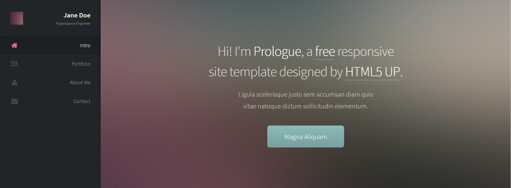
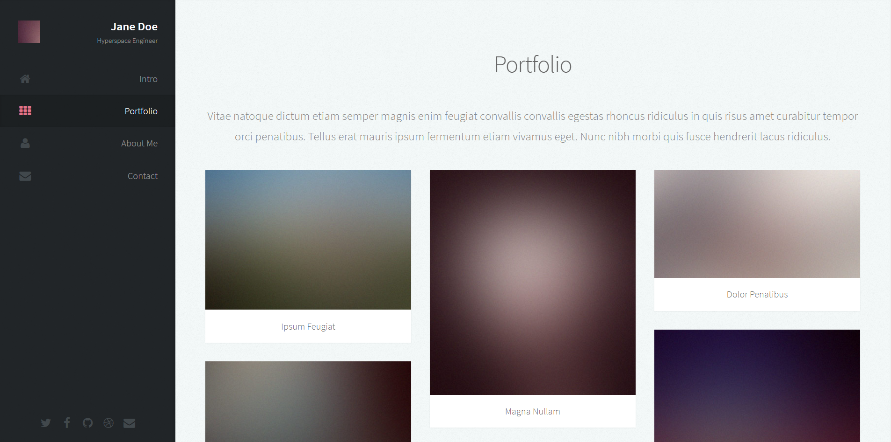
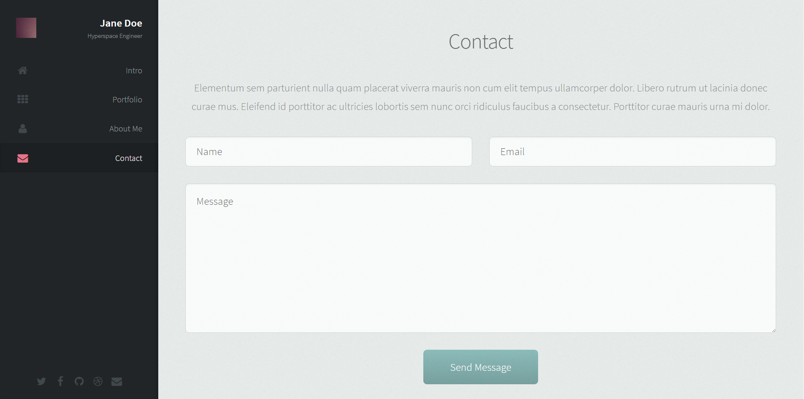

## Задание

Верстка макета

Основные цели:

1. Fixed sidebar
2. Flexible block with content
3. Implement grid using float property.
4. Simple contact form

Дополнительно:

5. Implement grid using flexbox.
6. Add some animation or transition effects.

### Примеры макета

### При завершении

1. Запуште вашу папку в *lectures/02_html_css_part-1/{firstname-lastname}*
2. Позовите ментора и покажите верстку.